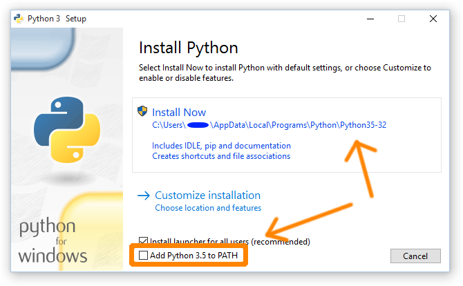

# Setup on Windows

First read the Setup chapter in the book without installing anything.

We suggest you, that you then follow these instructions, instead of the ones in the book.  
Both are about installing Python and the Atom editor, but here

- We focus only on Windows.
- We try to give some more details where you're more likely to get stuck.
- We suggest you to run your Python scripts inside of Atom, rather than using the terminal.

## Install Python

- Get Python 3 from the https://python.org website.
- Run the Python 3 installer and __make sure that you check the checkbox about adding Python to the PATH__:
  

It's fine to use the default "Install Now" setting, but you really should check the "Add Python 3 to PATH" checkbox befaure clicking on it!

If you forgot to add Python to the path, here are detailed instructions on how to manually do it:

- On Windows 8: http://stackoverflow.com/questions/21372637/installing-python-2-7-on-windows-8

## Install Atom with Python support

- Get Atom from <https://atom.io>.
- Run the Atom installer and make sure that you have a comfortable way to start it (in the Dock, on the Desktop, ...).
- Launch Atom.
- By default, Atom should provide the syntax highlighting for files that end in `.py`.
- In the preferences, add the "script" package (it could be in the "Packages" or in the "Install" section, filled under the Community Packages.  
  This package will allow you to run your scripts (or part of them) inside of the Atom editor.
- Type a simple Python script, and check that everything works correctly:
  
  ~~~.py
  print("hey!")
  ~~~
  
  save it with the name "hey.py" and run it through the "Packages > Script > Run Script" command.
- If everything worked well, you will get a split window in the lower part of the Atom text editor with the output of the program.

## Running Python programs

In the book, the author tells you to run the Python files in the terminal. You can do that, but on Windows it's much easier to run the programs inside of Atoms.

As you probably have seen, there is even a keyboard shortcut for running your the script in the current file: `ctrl-shift-b` (`b` is for build).

You will probably want to avoid going into the terminal. Except if you think it's fun to learn about it right now.

## Type, don't copy paste

One final hint: the book tells you what you should type. Do it. Really.  
Even if you're reading the HTML version on the same computer where you're typing the code, resist the temptation to copy paste the lines of code.  
The learn effect is much bigger if you type the code!

You will learn even more if, after having typed what the author tells you to type, you try to modify the code to do slightly different things.
